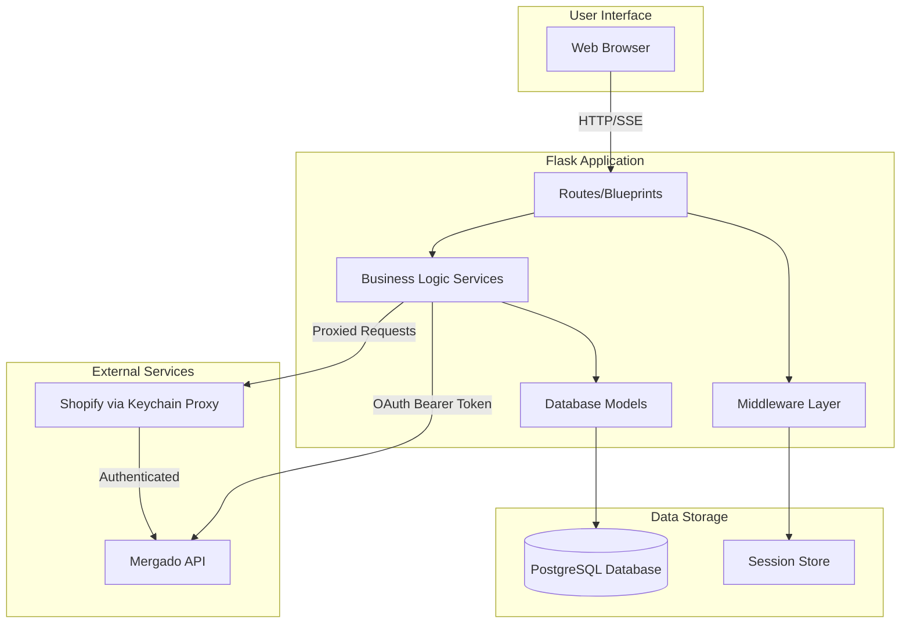
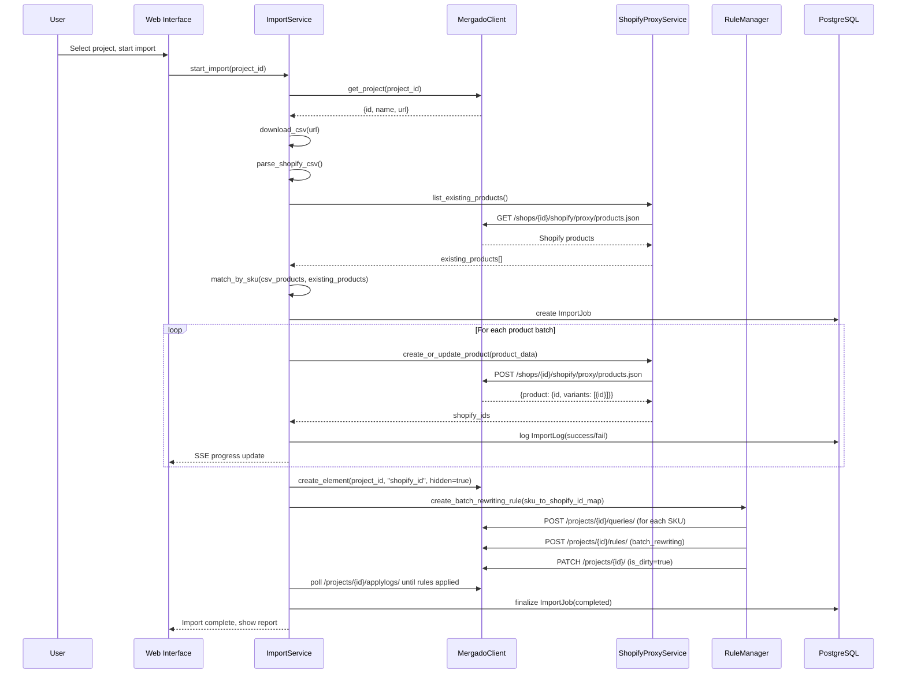
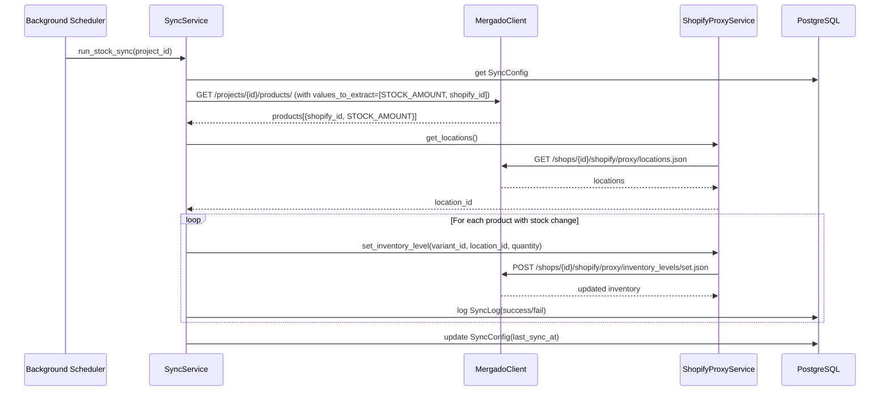
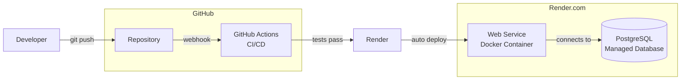

# Shopify Import & Sync - Architecture

## System Overview

The Shopify Import & Sync is a Flask-based web application that synchronizes product data between Mergado and Shopify through the Mergado Keychain Proxy.

## Core Components

### 1. Authentication Layer (app/auth/)
- **OAuth 2.0 Flow**: Authenticates users with Mergado
- **Token Management**: Stores access/refresh tokens in session
- **Security**: CSRF protection via state parameter
- See: [app/auth/CLAUDE.md](../app/auth/CLAUDE.md)

### 2. API Clients (app/services/)
- **MergadoClient**: Wrapper around Mergado REST API
  - Projects, products, elements, rules, queries
  - Automatic pagination, retry logic, error handling
- **ShopifyProxyService**: Calls Shopify API via Keychain Proxy
  - Products, variants, inventory, prices
  - Rate limiting (2 req/sec for REST API)
- See: [app/services/CLAUDE.md](../app/services/CLAUDE.md)

### 3. Business Logic Services (app/services/)
- **ImportService**: Handles product imports
  - Downloads CSV feed from Mergado project
  - Parses Shopify CSV format
  - Matches products by SKU/barcode
  - Creates/updates products in Shopify
  - Writes Shopify IDs back to Mergado via batch_rewriting rules
- **SyncService**: Manages stock/price synchronization
  - Periodic background jobs
  - Fetches data from Mergado
  - Updates Shopify via proxy
  - Logs all changes

### 4. Database Layer (app/models/)
- **SQLAlchemy ORM**: PostgreSQL database
- **Alembic Migrations**: Version-controlled schema changes
- Key Models: Shop, Project, ImportJob, ImportLog, SyncConfig, SyncLog
- See: [app/models/CLAUDE.md](../app/models/CLAUDE.md)

### 5. Web Routes (app/routes/)
- **main_bp**: Dashboard, project selection, import wizard
- **auth_bp**: OAuth login/callback, token refresh
- **api_bp**: REST API for frontend (import status, logs)
- Uses Jinja2 templates with Mergado UI System components

### 6. Middleware (app/middleware/)
- **Logging**: Structured JSON logging (production) or human-readable (dev)
- **Error Handling**: Catches exceptions, returns JSON or HTML based on request
- **Request ID Tracking**: Unique ID per request for debugging
- See: [app/middleware/CLAUDE.md](../app/middleware/CLAUDE.md)

## Data Flow: Product Import

## Data Flow: Stock Synchronization

## Security Architecture

### Authentication Flow
1. User clicks "Connect with Mergado"
2. Redirect to Mergado OAuth (`/oauth2/authorize`)
3. User approves in Mergado
4. Redirect back to `/auth/callback?code=...`
5. Exchange code for tokens (`POST /oauth2/token`)
6. Return HTML with inline JS to store tokens in localStorage
7. Redirect to dashboard
8. Frontend `AuthManager` manages token lifecycle (expiry check, refresh)
9. Backend receives tokens via Authorization header for API calls

### API Security
- All Mergado API calls require OAuth Bearer token
- Shopify API calls proxied through Mergado (Keychain handles auth)
- No Shopify credentials stored in this app
- Rate limiting on import/sync endpoints
- Input validation via Pydantic models

### Data Security
- Tokens stored in localStorage (client-side) for MVP
  - Managed by frontend AuthManager
  - Can migrate to HttpOnly cookies post-MVP for better security
- Database credentials via environment variables
- Secrets never logged or exposed in errors
- HTTPS only in production (enforced by Render)

## Deployment Architecture

### Production Stack
- **Hosting**: Render.com
- **Runtime**: Docker (multi-stage build)
- **Web Server**: Gunicorn (2 workers, 2 threads)
- **Database**: PostgreSQL 15 (managed by Render)
- **CI/CD**: GitHub Actions
- **Monitoring**: Render metrics + health endpoint

## Technology Decisions

Key architectural decisions documented as ADRs:
- [ADR-001: Batch Rewriting for Shopify IDs](adr/001-batch-rewriting-for-shopify-ids.md)
- [ADR-002: Mergado UI System Frontend](adr/002-mergado-ui-system-frontend.md)
- [ADR-003: Keychain Proxy for Shopify Auth](adr/003-keychain-proxy-shopify-auth.md)

## Performance Considerations

### Import Performance
- **CSV Parsing**: Stream processing for large files
- **Batch Operations**: 50 products per Shopify API call
- **Rate Limiting**: 2 req/sec to Shopify (proxy enforces this)
- **Progress Updates**: Server-Sent Events (SSE) for real-time UI
- **Expected**: ~100 products/minute import rate

### Sync Performance
- **Incremental**: Only sync products with changed stock/price
- **Scheduled**: Configurable interval (default: every hour)
- **Parallel**: Multiple projects can sync concurrently
- **Efficient**: Use `values_to_extract` parameter to fetch only needed data

### Database Performance
- **Indexes**: On foreign keys, frequently queried fields
- **Pagination**: All list endpoints support limit/offset
- **Connection Pooling**: SQLAlchemy pool (default 5 connections)

## Error Handling Strategy

### API Errors
- **Retry Logic**: Exponential backoff for transient errors (429, 502, 503, 504)
- **User Feedback**: Clear error messages in UI
- **Logging**: All errors logged with context (request ID, user, operation)
- **Notifications**: Critical errors sent via Mergado notifications API

### Import Failures
- **Partial Success**: Some products can fail without aborting entire import
- **Detailed Logs**: Per-product status (success/fail/skipped) with reason
- **Downloadable Report**: CSV with all results
- **Retry**: User can re-run import (matched products will be updated)

### Sync Failures
- **Continue on Error**: One product failure doesn't stop sync
- **Alert User**: Notification if >10% of products fail
- **Auto-Retry**: Next scheduled run will retry failed products

## Scalability

### Current Limits
- **Import**: ~100 products/min
- **Sync**: 1000+ products per sync run
- **Concurrent Users**: 10-20 (Starter Render instance)

### Scaling Strategy
1. **Vertical**: Upgrade Render instance type
2. **Database**: Add read replicas for reporting
3. **Background Jobs**: Add Celery workers for async processing
4. **Caching**: Redis for session store and API response cache
5. **CDN**: For static assets (if needed)

## Future Enhancements

- Multi-project support (import from multiple Mergado projects)
- Webhook listeners (real-time updates from Shopify)
- Advanced filtering (sync only certain product categories)
- Bulk operations (pause all syncs, re-import all)
- Analytics dashboard (import/sync trends over time)
